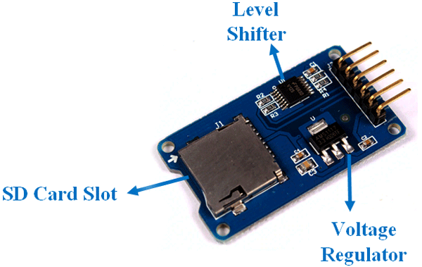
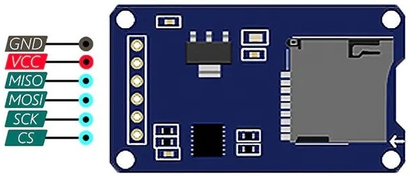
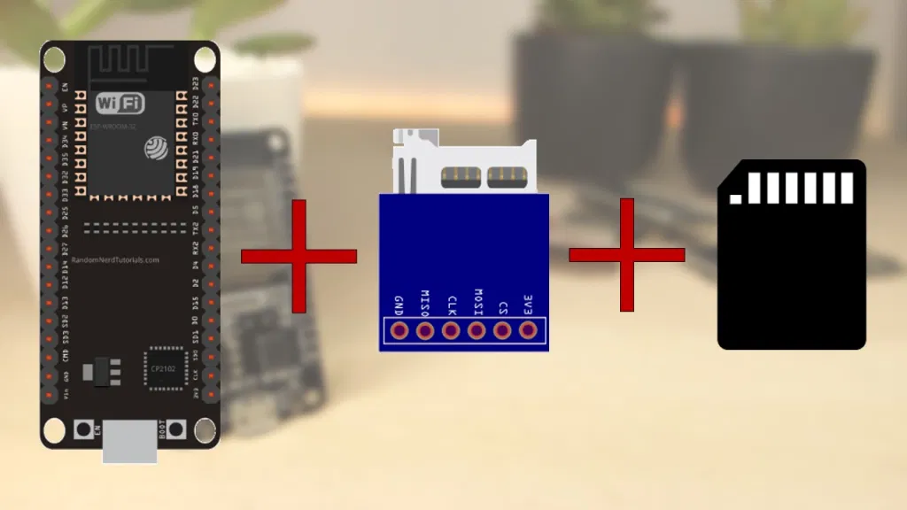
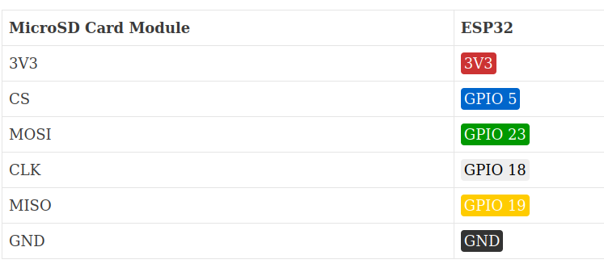

# SD Card Module/Adapter
### There are actually two ways to interface with micro SD cards – SPI mode and SDIO mode. 

### SPI mode is preferable since it’s less complex than SDIO.

### The operating voltage of micro SD Cards is 3.3 V. Therefore, we cannot SD Card directly with 5V logic. But the module has an onboard ultra-low dropout regulator that converts voltages from 3.3V – 6V down to ~3.3V. There is also a Logic Level converter IC 74LVC125A on the module which converts the interface logic from 3.3V-5V to 3.3V.  The module uses a 5V or 3.3V power supply.

### This Module has an SPI interface that is compatible with any SD card.

## Micro SD Card Module Pinout

### There are total of six pins (GND, VCC, MISO, MOSI, SCK, CS) on a SD-Card Adapter.

### 1. GND: Ground Pin
### 2. VCC: +5V power supply
### 3. MISO: SPI output
### 4. MOSI: SPI input
### 5. SCK: Accepts clock pulses for Data Synchronization
### 6. CS: Chip select signal pin to enable/disable line

### Before you insert the micro SD card into the module, you must properly format the card. You should format the SD card as FAT16 or FAT32.

### MISO, MOSI, SCK is the SPI bus.

## Micro SD CARD module data logging ESP32

## PIN CONNECTION

### Time stamp ,the date and time , is requested using Network Time Protocol (NTP).

## Referrence 
#### https://randomnerdtutorials.com/esp32-data-logging-temperature-to-microsd-card/
#### https://iotdesignpro.com/projects/logging-temperature-and-humidity-data-on-sd-card-using-esp32
